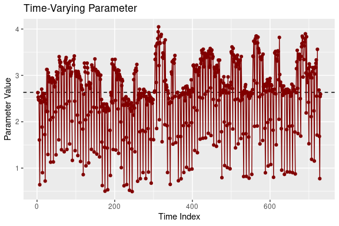

<!-- README.md is generated from README.Rmd. Please edit that file -->

# gasmodel

<!-- badges: start -->
<!-- badges: end -->

## Overview

A package for estimation, forecasting, and simulation of generalized
autoregressive score (GAS) models of Creal et al. (2013) and Harvey
(2013), also known as dynamic conditional score (DCS) models or
score-driven (SD) models.

Model specification allows for various conditional distributions,
different parametrizations, exogenous variables, higher score and
autoregressive orders, custom and unconditional initial values of
time-varying parameters, fixed and bounded values of coefficients, and
missing values. Model estimation is performed by the maximum likelihood
method.

The package offers the following functions for working with GAS models:

- `gas()` estimates GAS models.
- `gas_simulate()` simulates GAS models.
- `gas_forecast()` forecasts GAS models.
- `gas_filter()` obtains filtered time-varying parameters of GAS models.
- `gas_bootstrap()` bootstraps coefficients of GAS models.

The package handles probability distributions by the following
functions:

- `distr()` provides table of supported distributions.
- `distr_density()` computes the density of a given distribution.
- `distr_mean()` computes the mean of a given distribution.
- `distr_var()` computes the variance of a given distribution.
- `distr_score()` computes the score of a given distribution.
- `distr_fisher()` computes the Fisher information of a given
  distribution.
- `distr_random()` generates random observations from a given
  distribution.

In addition, the package provides the following datasets used in
examples:

- `bookshop_sales` contains times of antiquarian bookshop sales.
- `german_car_market_cap` contains the market capitalization of major
  German car manufacturers.
- `ice_hockey_championships` contains the results of the Ice Hockey
  World Championships.
- `sp500_daily` contains daily S&P 500 prices.

## Installation

To install the `gasmodel` package from CRAN, you can use:

``` r
install.packages("gasmodel")
```

To install the development version of the `gasmodel` package from
GitHub, you can use:

``` r
install.packages("devtools")
devtools::install_github("vladimirholy/gasmodel")
```

## Example

As a simple example, let us model volatility of daily S&P 500 prices in
2021 in the fashion of GARCH models. We estimate the GAS model based on
the Student’s t-distribution with time-varying volatility and plot the
filtered time-varying parameters:

``` r
library("dplyr")
library("ggplot2")
library("gasmodel")

data <- sp500_daily %>%
  mutate(return = log(close) - log(lag(close))) %>%
  filter(format(sp500_daily$date, "%Y") == "2021") %>%
  select(date, return)
summary(data)
#>       date                return         
#>  Min.   :2021-01-04   Min.   :-0.023512  
#>  1st Qu.:2021-04-05   1st Qu.:-0.006242  
#>  Median :2021-07-04   Median :-0.001423  
#>  Mean   :2021-07-03   Mean   :-0.001029  
#>  3rd Qu.:2021-10-01   3rd Qu.: 0.003219  
#>  Max.   :2021-12-31   Max.   : 0.026013

model_gas <- gas(y = data$return, distr = "t", par_static = c(TRUE, FALSE, TRUE))
model_gas
#> GAS Model: Student‘s t Distribution / Mean-Variance Parametrization / Unit Scaling 
#> 
#> Coefficients: 
#>                    Estimate  Std. Error  Z-Test  Pr(>|Z|)    
#> mean            -0.00145631  0.00042388 -3.4357 0.0005911 ***
#> log(var)_omega  -2.16158419  0.76650952 -2.8200 0.0048018 ** 
#> log(var)_alpha1  0.54442475  0.15216805  3.5778 0.0003465 ***
#> log(var)_phi1    0.78322463  0.07644654 10.2454 < 2.2e-16 ***
#> df              10.11802479  6.59431541  1.5344 0.1249422    
#> ---
#> Signif. codes:  0 '***' 0.001 '**' 0.01 '*' 0.05 '.' 0.1 ' ' 1
#> 
#> Log-Likelihood: 870.9712, AIC: -1731.942, BIC: -1714.295

plot(model_gas)
```



## Case Studies

To further illustrate the usability of GAS models, the package includes
the following case studies in the form of vignettes:

- `case_durations` analyzes the timing of online antiquarian bookshop
  orders.
- `case_rankings` analyzes the strength of national ice hockey teams
  using the annual Ice Hockey World Championships rankings.

## Supported Distributions

Currently, there are 35 distributions available.

The list of supported distribution can be obtained by the `distr()`
function:

``` r
distr() %>%
  arrange(!default, param) %>%
  select(distr, distr_title, dim, type, param) %>%
  group_by(distr, distr_title, dim, type) %>%
  summarize(param = paste(param, collapse = ", ")) %>%
  ungroup() %>%
  arrange(distr) %>%
  print(right = FALSE, row.names = FALSE)
#> # A tibble: 35 × 5
#>    distr     distr_title                     dim   type     param                  
#>    <chr>     <chr>                           <fct> <fct>    <chr>                  
#>  1 alaplace  Asymmetric Laplace              uni   real     meanscale              
#>  2 bernoulli Bernoulli                       uni   binary   prob                   
#>  3 beta      Beta                            uni   interval conc, meansize, meanvar
#>  4 bisa      Birnbaum-Saunders               uni   duration scale                  
#>  5 burr      Burr                            uni   duration scale                  
#>  6 cat       Categorical                     multi cat      worth                  
#>  7 dirichlet Dirichlet                       multi comp     conc                   
#>  8 dpois     Double Poisson                  uni   count    mean                   
#>  9 exp       Exponential                     uni   duration scale, rate            
#> 10 explog    Exponential-Logarithmic         uni   duration rate                   
#> 11 fisk      Fisk                            uni   duration scale                  
#> 12 gamma     Gamma                           uni   duration scale, rate            
#> 13 gengamma  Generalized Gamma               uni   duration scale, rate            
#> 14 geom      Geometric                       uni   count    mean, prob             
#> 15 kuma      Kumaraswamy                     uni   interval conc                   
#> 16 laplace   Laplace                         uni   real     meanscale              
#> 17 logistic  Logistic                        uni   real     meanscale              
#> 18 logitnorm Logit-Normal                    uni   interval logitmeanvar           
#> 19 lognorm   Log-Normal                      uni   duration logmeanvar             
#> 20 lomax     Lomax                           uni   duration scale                  
#> 21 mvnorm    Multivariate Normal             multi real     meanvar                
#> 22 mvt       Multivariate Student‘s t        multi real     meanvar                
#> 23 negbin    Negative Binomial               uni   count    nb2, prob              
#> 24 norm      Normal                          uni   real     meanvar                
#> 25 pluce     Plackett-Luce                   multi ranking  worth                  
#> 26 pois      Poisson                         uni   count    mean                   
#> 27 rayleigh  Rayleigh                        uni   duration scale                  
#> 28 skellam   Skellam                         uni   integer  meanvar, diff, meandisp
#> 29 t         Student‘s t                     uni   real     meanvar                
#> 30 vonmises  von Mises                       uni   circular meanconc               
#> 31 weibull   Weibull                         uni   duration scale, rate            
#> 32 zigeom    Zero-Inflated Geometric         uni   count    mean                   
#> 33 zinegbin  Zero-Inflated Negative Binomial uni   count    nb2                    
#> 34 zipois    Zero-Inflated Poisson           uni   count    mean                   
#> 35 ziskellam Zero-Inflated Skellam           uni   integer  meanvar, diff, meandisp
```

Details of each distribution, including its density function, expected
value, variance, score, and Fisher information, can be found in vignette
`distributions`.

## Generalized Autoregressive Score Models

The generalized autoregressive score (GAS) models of Creal et al. (2013)
and Harvey (2013), also known as dynamic conditional score (DCS) models
or score-driven (SD) models, have established themselves as a useful
modern framework for time series modeling.

The GAS models are observation-driven models allowing for any underlying
probability distribution $p(y_t|f_t)$ with any time-varying parameters
$f_t$ for time series $y_t$. They capture the dynamics of time-varying
parameters using the autoregressive term and the lagged score, i.e. the
gradient of the log-likelihood function. Exogenous variables can also be
included. Specifically, time-varying parameters $f_{t}$ follow the
recursion
$$f_{t} = \omega + \sum_{i=1}^M \beta_i x_{ti} + \sum_{j=1}^P \alpha_j S(f_{t - j}) \nabla(y_{t - j}, f_{t - j}) + \sum_{k=1}^Q \varphi_k f_{t-k},$$
where $\omega$ is a vector of constants, $\beta_i$ are regression
parameters, $\alpha_j$ are score parameters, $\varphi_k$ are
autoregressive parameters, $x_{ti}$ are exogenous variables, $S(f_t)$ is
a scaling function for the score, and $\nabla(y_t, f_t)$ is the score
given by
$$\nabla(y_t, f_t) = \frac{\partial \ln p(y_t | f_t)}{\partial f_t}.$$
Alternatively, a different model can be obtained by defining the
recursion in the fashion of regression models with dynamic errors as
$$f_{t} = \omega + \sum_{i=1}^M \beta_i x_{ti} + e_{t}, \quad e_t = \sum_{j=1}^P \alpha_j S(f_{t - j}) \nabla(y_{t - j}, f_{t - j}) + \sum_{k=1}^Q \varphi_k e_{t-k}.$$

The GAS models can be straightforwardly estimated by the maximum
likelihood method. For the asymptotic theory regarding the GAS models
and maximum likelihood estimation, see Blasques et al. (2014), Blasques
et al. (2018), and Blasques et al. (2022).

The use of the score for updating time-varying parameters is optimal in
an information theoretic sense. For an investigation of the optimality
properties of GAS models, see Blasques et al. (2015) and Blasques et
al. (2021).

Generally, the GAS models perform quite well when compared to
alternatives, including parameter-driven models. For a comparison of the
GAS models to alternative models, see Koopman et al. (2016) and Blazsek
and Licht (2020).

The GAS class includes many well-known econometric models, such as the
generalized autoregressive conditional heteroskedasticity (GARCH) model
of Bollerslev (1986), the autoregressive conditional duration (ACD)
model of Engle and Russel (1998), and the Poisson count model of Davis
et al. (2003). More recently, a variety of novel score-driven models has
been proposed, such as the Beta-t-(E)GARCH model of Harvey and
Chakravarty (2008), a Skellam model of Koopman et al. (2018), a
directional model of Harvey (2019), a bivariate Poisson model of Koopman
and Lit (2019), and a ranking model of Holý and Zouhar (2022). For an
overview of various GAS models, see Harvey (2022).

The extensive GAS literature is listed on
[www.gasmodel.com](http://www.gasmodel.com).

## References

Blasques, F., Gorgi, P., Koopman, S. J., and Wintenberger, O. (2018).
Feasible Invertibility Conditions and Maximum Likelihood Estimation for
Observation-Driven Models. *Electronic Journal of Statistics*,
**12**(1), 1019–1052. doi:
[10.1214/18-ejs1416](https://doi.org/10.1214/18-ejs1416).

Blasques, F., Koopman, S. J., and Lucas, A. (2014). Stationarity and
Ergodicity of Univariate Generalized Autoregressive Score Processes.
*Electronic Journal of Statistics*, **8**(1), 1088–1112. doi:
[10.1214/14-ejs924](https://doi.org/10.1214/14-ejs924).

Blasques, F., Koopman, S. J., and Lucas, A. (2015).
Information-Theoretic Optimality of Observation-Driven Time Series
Models for Continuous Responses. *Biometrika*, **102**(2), 325–343. doi:
[10.1093/biomet/asu076](https://doi.org/10.1093/biomet/asu076).

Blasques, F., Lucas, A., and van Vlodrop, A. C. (2021). Finite Sample
Optimality of Score-Driven Volatility Models: Some Monte Carlo Evidence.
*Econometrics and Statistics*, **19**, 47–57. doi:
[10.1016/j.ecosta.2020.03.010](https://doi.org/10.1016/j.ecosta.2020.03.010).

Blasques, F., van Brummelen, J., Koopman, S. J., and Lucas, A. (2022).
Maximum Likelihood Estimation for Score-Driven Models. *Journal of
Econometrics*, **227**(2), 325–346. doi:
[10.1016/j.jeconom.2021.06.003](https://doi.org/10.1016/j.jeconom.2021.06.003).

Blazsek, S. and Licht, A. (2020). Dynamic Conditional Score Models: A
Review of Their Applications. *Applied Economics*, **52**(11),
1181–1199. doi:
[10.1080/00036846.2019.1659498](https://doi.org/10.1080/00036846.2019.1659498).

Bollerslev, T. (1986). Generalized Autoregressive Conditional
Heteroskedasticity. *Journal of Econometrics*, **31**(3), 307–327. doi:
[10.1016/0304-4076(86)90063-1](https://doi.org/10.1016/0304-4076(86)90063-1).

Creal, D., Koopman, S. J., and Lucas, A. (2013). Generalized
Autoregressive Score Models with Applications. *Journal of Applied
Econometrics*, **28**(5), 777–795. doi:
[10.1002/jae.1279](https://doi.org/10.1002/jae.1279).

Davis, R. A., Dunsmuir, W. T. M., and Street, S. B. (2003).
Observation-Driven Models for Poisson Counts. *Biometrika*, **90**(4),
777–790. doi:
[10.1093/biomet/90.4.777](https://doi.org/10.1093/biomet/90.4.777).

Engle, R. F. and Russell, J. R. (1998). Autoregressive Conditional
Duration: A New Model for Irregularly Spaced Transaction Data.
*Econometrica*, **66**(5), 1127–1162. doi:
[10.2307/2999632](https://doi.org/10.2307/2999632).

Harvey, A. C. (2013). *Dynamic Models for Volatility and Heavy Tails:
With Applications to Financial and Economic Time Series*. Cambridge
University Press. doi:
[10.1017/cbo9781139540933](https://doi.org/10.1017/cbo9781139540933).

Harvey, A. C. (2022). Score-Driven Time Series Models. *Annual Review of
Statistics and Its Application*, **9**(1), 321–342. doi:
[10.1146/annurev-statistics-040120-021023](https://doi.org/10.1146/annurev-statistics-040120-021023).

Harvey, A. C. and Chakravarty, T. (2008). Beta-t-(E)GARCH. *Cambridge
Working Papers in Economics*, CWPE 0840. doi:
[10.17863/cam.5286](https://doi.org/10.17863/cam.5286).

Harvey, A., Hurn, S., and Thiele, S. (2019). Modeling Directional
(Circular) Time Series. *Cambridge Working Papers in Economics*, CWPE
1971. doi: [10.17863/cam.43915](https://doi.org/10.17863/cam.43915).

Holý, V. and Zouhar, J. (2022). Modelling Time-Varying Rankings with
Autoregressive and Score-Driven Dynamics. Journal of the Royal
Statistical Society: Series C (Applied Statistics), **71**(5). doi:
[10.1111/rssc.12584](https://doi.org/10.1111/rssc.12584).

Koopman, S. J. and Lit, R. (2019). Forecasting Football Match Results in
National League Competitions Using Score-Driven Time Series Models.
*International Journal of Forecasting*, **35**(2), 797–809. doi:
[10.1016/j.ijforecast.2018.10.011](https://doi.org/10.1016/j.ijforecast.2018.10.011).

Koopman, S. J., Lit, R., Lucas, A., and Opschoor, A. (2018). Dynamic
Discrete Copula Models for High-Frequency Stock Price Changes. *Journal
of Applied Econometrics*, **33**(7), 966–985. doi:
[10.1002/jae.2645](https://doi.org/10.1002/jae.2645).

Koopman, S. J., Lucas, A., and Scharth, M. (2016). Predicting
Time-Varying Parameters with Parameter-Driven and Observation-Driven
Models. *Review of Economics and Statistics*, **98**(1), 97–110. doi:
[10.1162/rest_a_00533](https://doi.org/10.1162/rest_a_00533).
