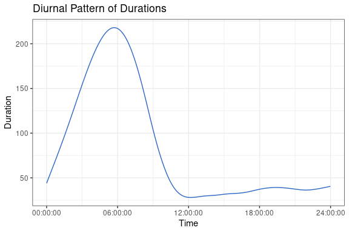

## Introduction

We loosely follow Tomanová and Holý (2021) and analyze the timing of orders from a Czech antiquarian bookshop. Besides seasonality and diurnal patterns, one would expect the times of orders to be independent of each other. However, this is not the case and we use a GAS model to capture dependence between the times of orders.

A strand of financial econometrics is devoted to analyzing the timing of transactions by the so-called autoregressive conditional duration (ACD) model introduced by Engle and Russell (1998). For a textbook treatment of such financial point processes, see e.g. Hautsch (2012).


```r
library(tidyverse)
library(gasmodel)
```

## Data Preparation

Let us prepare the analyzed data. We use data `bookshop_sales` containing times of orders from June 8, 2018 to December 20, 2018. We calculate differences of subsequent times, i.e. durations. To avoid zero durations, we set them to 0.5 second.


```r
data(bookshop_sales)
data_dur <- bookshop_sales %>%
  mutate(duration = as.numeric(time - lag(time)) / 60) %>%
  mutate(duration = recode(duration, "0" = 0.5)) %>%
  mutate(just_time = as.vector(as.POSIXct(format(time, "1970-01-01 %H:%M:%S"), tz = "UTC"))) %>%
  drop_na()
```

There is a strong diurnal pattern present, as we can see from the following figure:


```r
model_spline <- smooth.spline(data_dur$just_time, data_dur$duration, df = 10)

ggplot(mapping = aes(x = model_spline$x, y = model_spline$y)) +
  labs(title = "Diurnal Pattern of Durations", x = "Time", y = "Duration") +
  geom_line(color = "#2E67C5") +
  scale_x_time(breaks = seq(from = 0, to = 24 * 60 * 60, by = 6 * 60 * 60)) +
  theme_bw()
```



We adjust the observed durations for this diurnal pattern and extract the time series to be analyzed:


```r
data_dur <- data_dur %>%
  mutate(duration_spline = predict(model_spline, x = just_time)$y) %>%
  mutate(duration_adj = duration / duration_spline) %>%
  select(-just_time)

y <- data_dur$duration_adj
```

## Model Estimation


```r
distr(filter_type = "duration", filter_dim = "uni", filter_default = TRUE)[, 1:3]
#>          distr_title param_title    distr
#> 5        Exponential       Scale      exp
#> 7              Gamma       Scale    gamma
#> 9  Generalized Gamma       Scale gengamma
#> 24           Weibull       Scale  weibull
```

First, we estimate the model based on the exponential distribution:


```r
est_exp <- gas(y = y, distr = "exp")
#> Error in f[, 1, drop = FALSE]: incorrect number of dimensions
est_exp
#> Error in eval(expr, envir, enclos): object 'est_exp' not found
```

Second, we estimate the model based on the Weibull distribution:


```r
est_weibull <- gas(y = y, distr = "weibull", par_static = c(FALSE, TRUE))
est_weibull
#> GAS Model: Weibull Distribution / Scale Parametrization / Unit Scaling 
#> 
#> Coefficients: 
#>                     Estimate Std. Error   Z-Test  Pr(>|Z|)    
#> log(scale)_omega  -0.0019175  0.0013552  -1.4149    0.1571    
#> log(scale)_alpha1  0.0562619  0.0082010   6.8604 6.867e-12 ***
#> log(scale)_phi1    0.9622643  0.0102230  94.1278 < 2.2e-16 ***
#> shape              0.9442209  0.0094299 100.1300 < 2.2e-16 ***
#> ---
#> Signif. codes:  0 '***' 0.001 '**' 0.01 '*' 0.05 '.' 0.1 ' ' 1
#> 
#> Log-Likelihood: -5591.442, AIC: 11190.88, BIC: 11217.51
```

Third, we estimate the model based on the gamma distribution:


```r
est_gamma <- gas(y = y, distr = "gamma", par_static = c(FALSE, TRUE))
est_gamma
#> GAS Model: Gamma Distribution / Scale Parametrization / Unit Scaling 
#> 
#> Coefficients: 
#>                    Estimate Std. Error   Z-Test  Pr(>|Z|)    
#> log(scale)_omega  0.0013296  0.0013395   0.9926    0.3209    
#> log(scale)_alpha1 0.0518896  0.0071672   7.2399 4.491e-13 ***
#> log(scale)_phi1   0.9634327  0.0093853 102.6532 < 2.2e-16 ***
#> shape             0.9420850  0.0153854  61.2325 < 2.2e-16 ***
#> ---
#> Signif. codes:  0 '***' 0.001 '**' 0.01 '*' 0.05 '.' 0.1 ' ' 1
#> 
#> Log-Likelihood: -5601.735, AIC: 11211.47, BIC: 11238.1
```

Fourth, we estimate the model based on the generalized gamma distribution:


```r
est_gengamma <- gas(y = y, distr = "gengamma", par_static = c(FALSE, TRUE, TRUE))
est_gengamma
#> GAS Model: Generalized Gamma Distribution / Scale Parametrization / Unit Scaling 
#> 
#> Coefficients: 
#>                    Estimate Std. Error  Z-Test  Pr(>|Z|)    
#> log(scale)_omega  -0.049164   0.018903 -2.6009  0.009299 ** 
#> log(scale)_alpha1  0.069834   0.011670  5.9841 2.176e-09 ***
#> log(scale)_phi1    0.951761   0.015024 63.3493 < 2.2e-16 ***
#> shape1             1.764362   0.150759 11.7032 < 2.2e-16 ***
#> shape2             0.682971   0.033690 20.2723 < 2.2e-16 ***
#> ---
#> Signif. codes:  0 '***' 0.001 '**' 0.01 '*' 0.05 '.' 0.1 ' ' 1
#> 
#> Log-Likelihood: -5562.092, AIC: 11134.18, BIC: 11167.47
```

By comparing the Akaike information criterion (AIC), we find that the most general model, i.e. the one based on the generalized gamma distribution, is the most suitable.


```r
AIC(est_exp, est_weibull, est_gamma, est_gengamma)
#> Error in AIC(est_exp, est_weibull, est_gamma, est_gengamma): object 'est_exp' not found
```

## References

Engle, R. F. and Russell, J. R. (1998). Autoregressive Conditional Duration: A New Model for Irregularly Spaced Transaction Data. *Econometrica*, **66**(5), 1127–1162. doi: [10.2307/2999632](https://doi.org/10.2307/2999632).

Hautsch, N. (2012). *Econometrics of Financial High-Frequency Data*. Springer. doi: [10.1007/978-3-642-21925-2](https://doi.org/10.1007/978-3-642-21925-2).

Tomanová, P. and Holý, V. (2021). Clustering of Arrivals in Queueing Systems: Autoregressive Conditional Duration Approach. *Central European Journal of Operations Research*, **29**(3), 859–874. doi: [10.1007/s10100-021-00744-7](https://doi.org/10.1007/s10100-021-00744-7).

