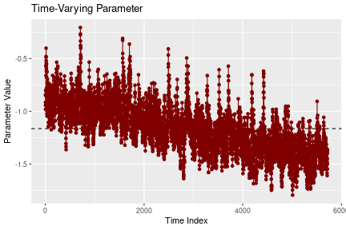
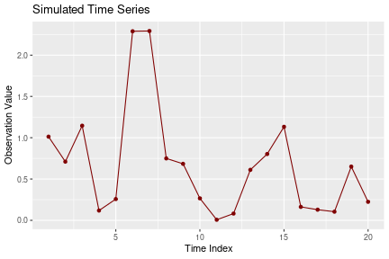

## Introduction

We loosely follow Tomanová and Holý (2021) and analyze the timing of orders from a Czech antiquarian bookshop. Besides seasonality and diurnal patterns, one would expect the times of orders to be independent of each other. However, this is not the case and we use a GAS model to capture dependence between the times of orders.

A strand of financial econometrics is devoted to analyzing the timing of transactions by the so-called autoregressive conditional duration (ACD) model introduced by Engle and Russell (1998). For a textbook treatment of such financial point processes, see e.g. Hautsch (2012).

## Data Preparation

Let us prepare the analyzed data. We use the `bookshop_orders` dataset containing times of orders from June 8, 2018 to December 20, 2018. The differences of subsequent times, i.e. durations, are already included in the dataset. Additionally, the dataset includes durations that have been adjusted for diurnal patterns using smoothing splines. This is the time series we are interested in.


```r
library("gasmodel")

data("bookshop_orders")

y <- bookshop_orders$duration_adj[-1]
```

## Model Estimation

The following distributions are available for our data type. We utilize the generalized gamma family.


```r
distr(filter_type = "duration", filter_dim = "uni")
#>                distr_title       param_title    distr      param     type dim orthog default
#> 6        Birnbaum-Saunders             Scale     bisa      scale duration uni   TRUE    TRUE
#> 7                     Burr             Scale     burr      scale duration uni  FALSE    TRUE
#> 11             Exponential              Rate      exp       rate duration uni   TRUE   FALSE
#> 12             Exponential             Scale      exp      scale duration uni   TRUE    TRUE
#> 13 Exponential-Logarithmic              Rate   explog       rate duration uni  FALSE    TRUE
#> 14                    Fisk             Scale     fisk      scale duration uni   TRUE    TRUE
#> 15                   Gamma              Rate    gamma       rate duration uni  FALSE   FALSE
#> 16                   Gamma             Scale    gamma      scale duration uni  FALSE    TRUE
#> 17       Generalized Gamma              Rate gengamma       rate duration uni  FALSE   FALSE
#> 18       Generalized Gamma             Scale gengamma      scale duration uni  FALSE    TRUE
#> 25              Log-Normal Log-Mean-Variance  lognorm logmeanvar duration uni   TRUE    TRUE
#> 26                   Lomax             Scale    lomax      scale duration uni  FALSE    TRUE
#> 34                Rayleigh             Scale rayleigh      scale duration uni   TRUE    TRUE
#> 40                 Weibull              Rate  weibull       rate duration uni  FALSE   FALSE
#> 41                 Weibull             Scale  weibull      scale duration uni  FALSE    TRUE
```

First, we estimate the model based on the exponential distribution. By default, the logarithmic link for the time-varying scale parameter is adopted. In this particular case, the Fisher information is constant and the three scalings are therefore equivalent.


```r
est_exp <- gas(y = y, distr = "exp")
est_exp
#> GAS Model: Exponential Distribution / Scale Parametrization / Unit Scaling 
#> 
#> Coefficients: 
#>                      Estimate  Std. Error   Z-Test  Pr(>|Z|)    
#> log(scale)_omega  -0.00089754  0.00117598  -0.7632    0.4453    
#> log(scale)_alpha1  0.04992815  0.00657547   7.5931 3.123e-14 ***
#> log(scale)_phi1    0.96278385  0.00918996 104.7647 < 2.2e-16 ***
#> ---
#> Signif. codes:  0 '***' 0.001 '**' 0.01 '*' 0.05 '.' 0.1 ' ' 1
#> 
#> Log-Likelihood: -5571.078, AIC: 11148.16, BIC: 11168.11
```

Second, we estimate the model based on the Weibull distribution. Compared to the exponential distribution, it has an additional shape parameter. By default, the first parameter is assumed time-varying while the remaining are assumed static. In our case, the model features the time-varying scale parameter with the constant shape parameter. However, it is possible to modify this behavior using the `par_static` argument.


```r
est_weibull <- gas(y = y, distr = "weibull")
est_weibull
#> GAS Model: Weibull Distribution / Scale Parametrization / Unit Scaling 
#> 
#> Coefficients: 
#>                     Estimate Std. Error  Z-Test  Pr(>|Z|)    
#> log(scale)_omega  -0.0019173  0.0013710 -1.3985     0.162    
#> log(scale)_alpha1  0.0569780  0.0081800  6.9655 3.272e-12 ***
#> log(scale)_phi1    0.9617316  0.0102214 94.0896 < 2.2e-16 ***
#> shape              0.9472091  0.0094738 99.9819 < 2.2e-16 ***
#> ---
#> Signif. codes:  0 '***' 0.001 '**' 0.01 '*' 0.05 '.' 0.1 ' ' 1
#> 
#> Log-Likelihood: -5555.903, AIC: 11119.81, BIC: 11146.41
```

Third, we estimate the model based on the gamma distribution. This is another generalization of the exponential distribution with an additional shape parameter.


```r
est_gamma <- gas(y = y, distr = "gamma")
est_gamma
#> GAS Model: Gamma Distribution / Scale Parametrization / Unit Scaling 
#> 
#> Coefficients: 
#>                    Estimate Std. Error   Z-Test  Pr(>|Z|)    
#> log(scale)_omega  0.0010440  0.0013489   0.7740    0.4389    
#> log(scale)_alpha1 0.0526020  0.0071647   7.3418 2.107e-13 ***
#> log(scale)_phi1   0.9627838  0.0094368 102.0247 < 2.2e-16 ***
#> shape             0.9491683  0.0155575  61.0102 < 2.2e-16 ***
#> ---
#> Signif. codes:  0 '***' 0.001 '**' 0.01 '*' 0.05 '.' 0.1 ' ' 1
#> 
#> Log-Likelihood: -5565.939, AIC: 11139.88, BIC: 11166.48
```

Fourth, we estimate the model based on the generalized gamma distribution. The generalized gamma distribution encompasses all three aforementioned distributions as special cases.


```r
est_gengamma <- gas(y = y, distr = "gengamma")
est_gengamma
#> GAS Model: Generalized Gamma Distribution / Scale Parametrization / Unit Scaling 
#> 
#> Coefficients: 
#>                    Estimate Std. Error  Z-Test  Pr(>|Z|)    
#> log(scale)_omega  -0.057636   0.021624 -2.6653  0.007691 ** 
#> log(scale)_alpha1  0.071908   0.011810  6.0889 1.137e-09 ***
#> log(scale)_phi1    0.950375   0.015152 62.7220 < 2.2e-16 ***
#> shape1             1.886317   0.168357 11.2043 < 2.2e-16 ***
#> shape2             0.660542   0.033779 19.5546 < 2.2e-16 ***
#> ---
#> Signif. codes:  0 '***' 0.001 '**' 0.01 '*' 0.05 '.' 0.1 ' ' 1
#> 
#> Log-Likelihood: -5521.126, AIC: 11052.25, BIC: 11085.51
```

By comparing the Akaike information criterion (AIC), we find that the most general model, i.e. the one based on the generalized gamma distribution, is the most suitable. For this purpose, we use generic function `AIC()`. Alternatively, the AIC of an estimated model is stored in `est_gengamma$fit$aic`.


```r
AIC(est_exp, est_weibull, est_gamma, est_gengamma)
#>              df      AIC
#> est_exp       3 11148.16
#> est_weibull   4 11119.81
#> est_gamma     4 11139.88
#> est_gengamma  5 11052.25
```

Let us take a look on the time-varying parameters of the generalized gamma model.


```r
plot(est_gengamma)
```

<div class="figure" style="text-align: center">

<p class="caption">Time-varying parameters based on the generalized gamma model.</p>
</div>

## Trend

We can see a slight negative trend in time-varying parameters. We can try including a trend as an exogenous variable for all four considered distributions.


```r
x <- as.integer(as.Date(bookshop_orders$datetime[-1])) - 17690

est_exp_tr <- gas(y = y, x = x, distr = "exp", reg = "sep")
est_exp_tr
#> GAS Model: Exponential Distribution / Scale Parametrization / Unit Scaling 
#> 
#> Coefficients: 
#>                      Estimate  Std. Error  Z-Test  Pr(>|Z|)    
#> log(scale)_omega   0.29796923  0.04555104  6.5414 6.093e-11 ***
#> log(scale)_beta1  -0.00306464  0.00037483 -8.1760 2.934e-16 ***
#> log(scale)_alpha1  0.05458719  0.00793868  6.8761 6.151e-12 ***
#> log(scale)_phi1    0.91427487  0.02071189 44.1425 < 2.2e-16 ***
#> ---
#> Signif. codes:  0 '***' 0.001 '**' 0.01 '*' 0.05 '.' 0.1 ' ' 1
#> 
#> Log-Likelihood: -5546.41, AIC: 11100.82, BIC: 11127.43

est_weibull_tr <- gas(y = y, x = x, distr = "weibull", reg = "sep")
est_weibull_tr
#> GAS Model: Weibull Distribution / Scale Parametrization / Unit Scaling 
#> 
#> Coefficients: 
#>                      Estimate  Std. Error  Z-Test  Pr(>|Z|)    
#> log(scale)_omega   0.27259433  0.04799805  5.6793 1.353e-08 ***
#> log(scale)_beta1  -0.00304756  0.00039284 -7.7578 8.640e-15 ***
#> log(scale)_alpha1  0.06213485  0.00967455  6.4225 1.341e-10 ***
#> log(scale)_phi1    0.91083171  0.02285770 39.8479 < 2.2e-16 ***
#> shape              0.95160961  0.00954366 99.7112 < 2.2e-16 ***
#> ---
#> Signif. codes:  0 '***' 0.001 '**' 0.01 '*' 0.05 '.' 0.1 ' ' 1
#> 
#> Log-Likelihood: -5533.828, AIC: 11077.66, BIC: 11110.91

est_gamma_tr <- gas(y = y, x = x, distr = "gamma", reg = "sep")
est_gamma_tr
#> GAS Model: Gamma Distribution / Scale Parametrization / Unit Scaling 
#> 
#> Coefficients: 
#>                      Estimate  Std. Error  Z-Test  Pr(>|Z|)    
#> log(scale)_omega   0.34382456  0.04940370  6.9595 3.415e-12 ***
#> log(scale)_beta1  -0.00306464  0.00038353 -7.9907 1.342e-15 ***
#> log(scale)_alpha1  0.05714860  0.00855559  6.6797 2.395e-11 ***
#> log(scale)_phi1    0.91427486  0.02119257 43.1413 < 2.2e-16 ***
#> shape              0.95518003  0.01566489 60.9759 < 2.2e-16 ***
#> ---
#> Signif. codes:  0 '***' 0.001 '**' 0.01 '*' 0.05 '.' 0.1 ' ' 1
#> 
#> Log-Likelihood: -5542.452, AIC: 11094.9, BIC: 11128.16

est_gengamma_tr <- gas(y = y, x = x, distr = "gengamma", reg = "sep")
est_gengamma_tr
#> GAS Model: Generalized Gamma Distribution / Scale Parametrization / Unit Scaling 
#> 
#> Coefficients: 
#>                      Estimate  Std. Error  Z-Test  Pr(>|Z|)    
#> log(scale)_omega  -0.84823616  0.21103504 -4.0194 5.834e-05 ***
#> log(scale)_beta1  -0.00295781  0.00039514 -7.4855 7.129e-14 ***
#> log(scale)_alpha1  0.08248222  0.01361272  6.0592 1.368e-09 ***
#> log(scale)_phi1    0.87825862  0.03321251 26.4436 < 2.2e-16 ***
#> shape1             1.88969866  0.17087187 11.0592 < 2.2e-16 ***
#> shape2             0.66228593  0.03432663 19.2936 < 2.2e-16 ***
#> ---
#> Signif. codes:  0 '***' 0.001 '**' 0.01 '*' 0.05 '.' 0.1 ' ' 1
#> 
#> Log-Likelihood: -5500.065, AIC: 11012.13, BIC: 11052.04
```

The trend variable is significant in all cases. The AIC also confirms improvement of the fit.


```r
AIC(est_exp_tr, est_weibull_tr, est_gamma_tr, est_gengamma_tr)
#>                 df      AIC
#> est_exp_tr       4 11100.82
#> est_weibull_tr   5 11077.66
#> est_gamma_tr     5 11094.90
#> est_gengamma_tr  6 11012.13
```

Note that the time-varying parameters returned by the `gas()` function include the effect of exogenous variables. By using the `plot()` function, the now modeled trend can be clearly seen.


```r
plot(est_gengamma_tr)
```

<div class="figure" style="text-align: center">

<p class="caption">Time-varying parameters based on the generalized gamma model with trend.</p>
</div>

## Bootstrapping

To assess the suitability of standard deviations based on asymptotics for our finite sample, we employ the `gas_bootstrap()` function. This function conducts a parametric bootstrap, allowing us to calculate standard errors and quantiles. It's important to note that this could be computationally very intensive, depending on the number of repetitions, the quantity of observations, the complexity of the model structure, and the optimizer used. Note that the function supports parallelization through arguments `parallel_function` and `parallel_arguments`. For example, for the `snow` parallelization functionality with 4 cores, you can call `gas_bootstrap(est_gengamma_tr, parallel_function = wrapper_parallel_snow, parallel_arguments = list(spec = 4))`.


```r
set.seed(42)
boot_gengamma_tr <- gas_bootstrap(est_gengamma_tr, method = "parametric", rep_boot = 100)
boot_gengamma_tr
#> GAS Model: Generalized Gamma Distribution / Scale Parametrization / Unit Scaling 
#> 
#> Method: Parametric Bootstrap 
#> 
#> Number of Bootstrap Samples: 100 
#> 
#> Bootstrapped Coefficients: 
#>                       Original         Mean   Std. Error P-Value         2.5%       97.5%
#> log(scale)_omega  -0.848236158 -0.842209482 0.2167730720       0 -1.363494729 -0.48985072
#> log(scale)_beta1  -0.002957812 -0.002958998 0.0003882626       0 -0.003716998 -0.00218889
#> log(scale)_alpha1  0.082482219  0.080713448 0.0112301969       0  0.059672742  0.10357046
#> log(scale)_phi1    0.878258619  0.874389999 0.0311604443       0  0.813825846  0.92564283
#> shape1             1.889698658  1.887747102 0.1815016954       0  1.588541151  2.30737901
#> shape2             0.662285932  0.665782378 0.0353508015       0  0.593998755  0.72810791
```

The results can also be viewed in a boxplot.


```r
plot(boot_gengamma_tr)
```

<div class="figure" style="text-align: center">

<p class="caption">Boxplot of bootstrapped coefficients based on the generalized gamma model with trend.</p>
</div>

Given that the number of observations in our model is 5752 (accessible through `est_gengamma_tr$model$t`), it is reasonable to anticipate that standard deviations based on asymptotics would yield precise results. Fortunately, this holds true in our scenario. Note that standard deviations can also be obtained using the `vcov()` generic function for both `est_gengamma_tr` and `boot_gengamma_tr`.


```r
est_gengamma_tr$fit$coef_sd - boot_gengamma_tr$bootstrap$coef_sd
#>  log(scale)_omega  log(scale)_beta1 log(scale)_alpha1   log(scale)_phi1            shape1 
#>     -5.738027e-03      6.877385e-06      2.382526e-03      2.052065e-03     -1.062983e-02 
#>            shape2 
#>     -1.024169e-03
```

## Simulation

Lastly, we highlight the utilization of simulation techniques. Simulation is executed using the `gas_simulate()` function, which can be supplied with either an estimated model or a custom model structure.


```r
t_sim <- 20
x_sim <- rep(max(x) + 1, t_sim)

set.seed(42)
sim_gengamma_tr <- gas_simulate(est_gengamma_tr, t_sim = t_sim, x_sim = x_sim)
sim_gengamma_tr
#> GAS Model: Generalized Gamma Distribution / Scale Parametrization / Unit Scaling 
#> 
#> Simulations: 
#>          t1          t2          t3          t4          t5          t6          t7          t8 
#> 1.012906817 0.709825947 1.145436580 0.118002151 0.257303884 2.289065205 2.292494996 0.749569859 
#>          t9         t10         t11         t12         t13         t14         t15         t16 
#> 0.683965696 0.265536370 0.006713397 0.081422285 0.611021641 0.802745017 1.131981476 0.162341162 
#>         t17         t18         t19         t20 
#> 0.128581898 0.104261067 0.650304016 0.223734674
```

The simulated time series can be plotted using the generic `plot()` function.


```r
plot(sim_gengamma_tr)
```

<div class="figure" style="text-align: center">

<p class="caption">Simulated time series based on the generalized gamma model with trend.</p>
</div>

The simulated time series can be employed, for example, to assess the impact of order arrivals on queuing systems, as demonstrated by Tomanová and Holý (2021).

## References

Engle, R. F. and Russell, J. R. (1998). Autoregressive Conditional Duration: A New Model for Irregularly Spaced Transaction Data. *Econometrica*, **66**(5), 1127–1162. doi: [10.2307/2999632](https://doi.org/10.2307/2999632).

Hautsch, N. (2012). *Econometrics of Financial High-Frequency Data*. Springer. doi: [10.1007/978-3-642-21925-2](https://doi.org/10.1007/978-3-642-21925-2).

Tomanová, P. and Holý, V. (2021). Clustering of Arrivals in Queueing Systems: Autoregressive Conditional Duration Approach. *Central European Journal of Operations Research*, **29**(3), 859–874. doi: [10.1007/s10100-021-00744-7](https://doi.org/10.1007/s10100-021-00744-7).

