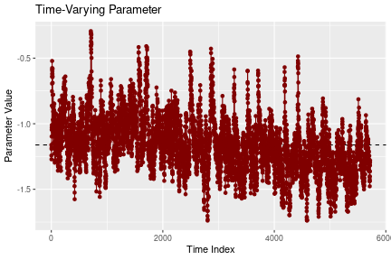
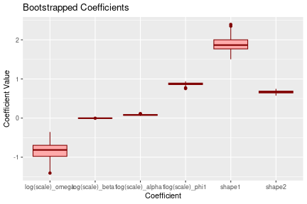

## Introduction

We loosely follow Tomanová and Holý (2021) and analyze the timing of orders from a Czech antiquarian bookshop. Besides seasonality and diurnal patterns, one would expect the times of orders to be independent of each other. However, this is not the case and we use a GAS model to capture dependence between the times of orders.

A strand of financial econometrics is devoted to analyzing the timing of transactions by the so-called autoregressive conditional duration (ACD) model introduced by Engle and Russell (1998). For a textbook treatment of such financial point processes, see e.g. Hautsch (2012).

## Data Preparation

Let us prepare the analyzed data. We use the `bookshop_sales` dataset containing times of orders from June 8, 2018 to December 20, 2018. We calculate differences of subsequent times, i.e. durations. To avoid zero durations, we set them to 0.5 second.


```r
library(dplyr)
library(tidyr)
library(ggplot2)
library(hms)
library(gasmodel)

data(bookshop_sales)

data_dur <- bookshop_sales %>%
  as_tibble() %>%
  rename(datetime = time) %>%
  mutate(date = as.Date(datetime)) %>%
  mutate(time = as_hms(datetime)) %>%
  mutate(duration = as.numeric(datetime - lag(datetime)) / 60) %>%
  mutate(duration = recode(duration, "0" = 0.5)) %>%
  drop_na()
```

## Diurnal Adjustment

We adjust the observed durations for diurnal pattern and extract the time series to be analyzed.


```r
model_spline <- smooth.spline(as.vector(data_dur$time), data_dur$duration, df = 10)

data_dur <- data_dur %>%
  mutate(duration_spline = predict(model_spline, x = as.vector(time))$y) %>%
  mutate(duration_adj = duration / duration_spline)

y <- data_dur$duration_adj
```

## Model Estimation

The following distributions are available for our data type. We utilize the generalized gamma family.


```r
distr(filter_type = "duration", filter_dim = "uni")
#>          distr_title param_title    distr param     type dim orthog default
#> 6  Birnbaum-Saunders       Scale     bisa scale duration uni   TRUE    TRUE
#> 10       Exponential        Rate      exp  rate duration uni   TRUE   FALSE
#> 11       Exponential       Scale      exp scale duration uni   TRUE    TRUE
#> 12             Gamma        Rate    gamma  rate duration uni  FALSE   FALSE
#> 13             Gamma       Scale    gamma scale duration uni  FALSE    TRUE
#> 14 Generalized Gamma        Rate gengamma  rate duration uni  FALSE   FALSE
#> 15 Generalized Gamma       Scale gengamma scale duration uni  FALSE    TRUE
#> 31           Weibull        Rate  weibull  rate duration uni  FALSE   FALSE
#> 32           Weibull       Scale  weibull scale duration uni  FALSE    TRUE
```

First, we estimate the model based on the exponential distribution. By default, the logarithmic link for the time-varying scale parameter is adopted. In this particular case, the Fisher information is constant and the three scalings are therefore equivalent.


```r
est_exp <- gas(y = y, distr = "exp")
est_exp
#> GAS Model: Exponential Distribution / Scale Parametrization / Unit Scaling 
#> 
#> Coefficients: 
#>                      Estimate  Std. Error   Z-Test  Pr(>|Z|)    
#> log(scale)_omega  -0.00085202  0.00114896  -0.7416    0.4584    
#> log(scale)_alpha1  0.04888439  0.00650562   7.5142 5.727e-14 ***
#> log(scale)_phi1    0.96343265  0.00910508 105.8126 < 2.2e-16 ***
#> ---
#> Signif. codes:  0 '***' 0.001 '**' 0.01 '*' 0.05 '.' 0.1 ' ' 1
#> 
#> Log-Likelihood: -5608.518, AIC: 11223.04, BIC: 11243.01
```

Second, we estimate the model based on the Weibull distribution. Compared to the exponential distribution, it has an additional shape parameter. By default, the first parameter is assumed time-varying while the remaining are assumed static. In our case, the model features the time-varying scale parameter with the constant shape parameter. However, it is possible to modify this behavior using the `par_static` argument.


```r
est_weibull <- gas(y = y, distr = "weibull")
est_weibull
#> GAS Model: Weibull Distribution / Scale Parametrization / Unit Scaling 
#> 
#> Coefficients: 
#>                     Estimate Std. Error   Z-Test  Pr(>|Z|)    
#> log(scale)_omega  -0.0019175  0.0013552  -1.4149    0.1571    
#> log(scale)_alpha1  0.0562619  0.0082010   6.8604 6.867e-12 ***
#> log(scale)_phi1    0.9622643  0.0102230  94.1278 < 2.2e-16 ***
#> shape              0.9442209  0.0094299 100.1300 < 2.2e-16 ***
#> ---
#> Signif. codes:  0 '***' 0.001 '**' 0.01 '*' 0.05 '.' 0.1 ' ' 1
#> 
#> Log-Likelihood: -5591.442, AIC: 11190.88, BIC: 11217.51
```

Third, we estimate the model based on the gamma distribution. This is another generalization of the exponential distribution with an additional shape parameter.


```r
est_gamma <- gas(y = y, distr = "gamma")
est_gamma
#> GAS Model: Gamma Distribution / Scale Parametrization / Unit Scaling 
#> 
#> Coefficients: 
#>                    Estimate Std. Error   Z-Test  Pr(>|Z|)    
#> log(scale)_omega  0.0013296  0.0013395   0.9926    0.3209    
#> log(scale)_alpha1 0.0518896  0.0071672   7.2399 4.491e-13 ***
#> log(scale)_phi1   0.9634327  0.0093853 102.6532 < 2.2e-16 ***
#> shape             0.9420850  0.0153854  61.2325 < 2.2e-16 ***
#> ---
#> Signif. codes:  0 '***' 0.001 '**' 0.01 '*' 0.05 '.' 0.1 ' ' 1
#> 
#> Log-Likelihood: -5601.735, AIC: 11211.47, BIC: 11238.1
```

Fourth, we estimate the model based on the generalized gamma distribution. The generalized gamma distribution encompasses all three aforementioned distributions as special cases.


```r
est_gengamma <- gas(y = y, distr = "gengamma")
est_gengamma
#> GAS Model: Generalized Gamma Distribution / Scale Parametrization / Unit Scaling 
#> 
#> Coefficients: 
#>                    Estimate Std. Error  Z-Test  Pr(>|Z|)    
#> log(scale)_omega  -0.049164   0.018903 -2.6009  0.009299 ** 
#> log(scale)_alpha1  0.069834   0.011670  5.9841 2.176e-09 ***
#> log(scale)_phi1    0.951761   0.015024 63.3493 < 2.2e-16 ***
#> shape1             1.764362   0.150759 11.7032 < 2.2e-16 ***
#> shape2             0.682971   0.033690 20.2723 < 2.2e-16 ***
#> ---
#> Signif. codes:  0 '***' 0.001 '**' 0.01 '*' 0.05 '.' 0.1 ' ' 1
#> 
#> Log-Likelihood: -5562.092, AIC: 11134.18, BIC: 11167.47
```

By comparing the Akaike information criterion (AIC), we find that the most general model, i.e. the one based on the generalized gamma distribution, is the most suitable. For this purpose, we use generic function `AIC()`. Alternatively, the AIC of an estimated model is stored in `est_gengamma$fit$aic`.


```r
AIC(est_exp, est_weibull, est_gamma, est_gengamma)
#>              df      AIC
#> est_exp       3 11223.04
#> est_weibull   4 11190.88
#> est_gamma     4 11211.47
#> est_gengamma  5 11134.18
```

Let us take a look on the time-varying parameters of the generalized gamma model.


```r
plot(est_gengamma)
```

<div class="figure" style="text-align: center">

<p class="caption">Time-varying parameters based on the generalized gamma model.</p>
</div>

## Trend

We can see a slight negative trend in time-varying parameters. We can try including a trend as an exogenous variable for all four considered distributions.


```r
x <- as.integer(data_dur$date) - as.integer(data_dur$date[1])

est_exp_tr <- gas(y = y, x = x, distr = "exp", reg = "sep")
est_exp_tr
#> GAS Model: Exponential Distribution / Scale Parametrization / Unit Scaling 
#> 
#> Coefficients: 
#>                      Estimate  Std. Error  Z-Test  Pr(>|Z|)    
#> log(scale)_omega   0.29683416  0.04509203  6.5829 4.615e-11 ***
#> log(scale)_beta1  -0.00304957  0.00037137 -8.2118 < 2.2e-16 ***
#> log(scale)_alpha1  0.05401728  0.00802442  6.7316 1.678e-11 ***
#> log(scale)_phi1    0.91358230  0.02146703 42.5575 < 2.2e-16 ***
#> ---
#> Signif. codes:  0 '***' 0.001 '**' 0.01 '*' 0.05 '.' 0.1 ' ' 1
#> 
#> Log-Likelihood: -5583.723, AIC: 11175.45, BIC: 11202.08

est_weibull_tr <- gas(y = y, x = x, distr = "weibull", reg = "sep")
est_weibull_tr
#> GAS Model: Weibull Distribution / Scale Parametrization / Unit Scaling 
#> 
#> Coefficients: 
#>                      Estimate  Std. Error  Z-Test  Pr(>|Z|)    
#> log(scale)_omega   0.26955739  0.04763575  5.6587 1.525e-08 ***
#> log(scale)_beta1  -0.00302892  0.00039014 -7.7638 8.244e-15 ***
#> log(scale)_alpha1  0.06215424  0.00992563  6.2620 3.801e-10 ***
#> log(scale)_phi1    0.90950196  0.02399584 37.9025 < 2.2e-16 ***
#> shape              0.94858384  0.00949927 99.8586 < 2.2e-16 ***
#> ---
#> Signif. codes:  0 '***' 0.001 '**' 0.01 '*' 0.05 '.' 0.1 ' ' 1
#> 
#> Log-Likelihood: -5569.405, AIC: 11148.81, BIC: 11182.1

est_gamma_tr <- gas(y = y, x = x, distr = "gamma", reg = "sep")
est_gamma_tr
#> GAS Model: Gamma Distribution / Scale Parametrization / Unit Scaling 
#> 
#> Coefficients: 
#>                      Estimate  Std. Error  Z-Test  Pr(>|Z|)    
#> log(scale)_omega   0.35024097  0.04910603  7.1323 9.868e-13 ***
#> log(scale)_beta1  -0.00304957  0.00038142 -7.9954 1.292e-15 ***
#> log(scale)_alpha1  0.05698059  0.00874363  6.5168 7.182e-11 ***
#> log(scale)_phi1    0.91358230  0.02204841 41.4353 < 2.2e-16 ***
#> shape              0.94799429  0.01549052 61.1983 < 2.2e-16 ***
#> ---
#> Signif. codes:  0 '***' 0.001 '**' 0.01 '*' 0.05 '.' 0.1 ' ' 1
#> 
#> Log-Likelihood: -5578.303, AIC: 11166.61, BIC: 11199.89

est_gengamma_tr <- gas(y = y, x = x, distr = "gengamma", reg = "sep")
est_gengamma_tr
#> GAS Model: Generalized Gamma Distribution / Scale Parametrization / Unit Scaling 
#> 
#> Coefficients: 
#>                      Estimate  Std. Error  Z-Test  Pr(>|Z|)    
#> log(scale)_omega  -0.70489163  0.19283438 -3.6554 0.0002568 ***
#> log(scale)_beta1  -0.00292746  0.00039123 -7.4827 7.280e-14 ***
#> log(scale)_alpha1  0.08164957  0.01387329  5.8854 3.971e-09 ***
#> log(scale)_phi1    0.87684184  0.03506612 25.0054 < 2.2e-16 ***
#> shape1             1.76342697  0.15253550 11.5608 < 2.2e-16 ***
#> shape2             0.68568220  0.03426457 20.0114 < 2.2e-16 ***
#> ---
#> Signif. codes:  0 '***' 0.001 '**' 0.01 '*' 0.05 '.' 0.1 ' ' 1
#> 
#> Log-Likelihood: -5541.097, AIC: 11094.19, BIC: 11134.14
```

The trend variable is significant in all cases. The AIC also confirms improvement of the fit.


```r
AIC(est_exp_tr, est_weibull_tr, est_gamma_tr, est_gengamma_tr)
#>                 df      AIC
#> est_exp_tr       4 11175.45
#> est_weibull_tr   5 11148.81
#> est_gamma_tr     5 11166.61
#> est_gengamma_tr  6 11094.19
```

Note that the time-varying parameters returned by the `gas()` function include the effect of exogenous variables. By using the `plot()` function, the now modeled trend can be clearly seen.


```r
plot(est_gengamma_tr)
```

<div class="figure" style="text-align: center">

<p class="caption">Time-varying parameters based on the generalized gamma model with trend.</p>
</div>

## Bootstrapping

To assess the suitability of standard deviations based on asymptotics for our finite sample, we employ the `gas_bootstrap()` function. This function conducts a parametric bootstrap, allowing us to calculate standard errors and quantiles. It's important to note that this could be computationally very intensive, depending on the number of repetitions, the quantity of observations, the complexity of the model structure, and the optimizer used. Note that the function supports parallelization through arguments `parallel_function` and `parallel_arguments`. For example, for the `snow` parallelization functionality with 4 cores, you can call `gas_bootstrap(est_gengamma_tr, parallel_function = wrapper_parallel_snow, parallel_arguments = list(mc.cores = 4))`.


```r
set.seed(42)
boot_gengamma_tr <- gas_bootstrap(est_gengamma_tr)
boot_gengamma_tr
#> GAS Model: Generalized Gamma Distribution / Scale Parametrization / Unit Scaling 
#> 
#> Method: Parametric Bootstrap 
#> 
#> Number of Bootstrap Samples: 1000 
#> 
#> Bootstrapped Coefficients: 
#>                       Original         Mean   Std. Error P-Value         2.5%       97.5%
#> log(scale)_omega  -0.704891626 -0.705226357 0.1980063054       0 -1.110703445 -0.34772409
#> log(scale)_beta1  -0.002927462 -0.002932047 0.0003883289       0 -0.003698968 -0.00217132
#> log(scale)_alpha1  0.081649573  0.081648774 0.0116918758       0  0.059179321  0.10575927
#> log(scale)_phi1    0.876841843  0.871223702 0.0297172317       0  0.806282230  0.91973863
#> shape1             1.763426971  1.765458333 0.1596470324       0  1.476831790  2.09983786
#> shape2             0.685682201  0.688266197 0.0354034049       0  0.623633255  0.76097862
```

The results can also be viewed in a boxplot.


```r
plot(boot_gengamma_tr)
```

<div class="figure" style="text-align: center">

<p class="caption">Boxplot of bootstrapped coefficients based on the generalized gamma model with trend.</p>
</div>

Given that the number of observations in our model is 5752 (accessible through `est_gengamma_tr$model$t`), it is reasonable to anticipate that standard deviations based on asymptotics would yield precise results. Fortunately, this holds true in our scenario. Note that standard deviations can also be obtained using the `vcov()` generic function for both `est_gengamma_tr` and `boot_gengamma_tr`.


```r
est_gengamma_tr$fit$coef_sd - boot_gengamma_tr$bootstrap$coef_sd
#>  log(scale)_omega  log(scale)_beta1 log(scale)_alpha1   log(scale)_phi1            shape1 
#>     -5.171928e-03      2.900388e-06      2.181417e-03      5.348887e-03     -7.111530e-03 
#>            shape2 
#>     -1.138839e-03 
```

## Simulation

Lastly, we highlight the utilization of simulation techniques. Simulation is executed using the `gas_simulate()` function, which can be supplied with either an estimated model or a custom model structure.


```r
t_sim <- 20
x_sim <- rep(max(x) + 1, t_sim)

set.seed(42)
sim_gengamma_tr <- gas_simulate(est_gengamma_tr, t_sim = t_sim, x_sim = x_sim)
sim_gengamma_tr
#> GAS Model: Generalized Gamma Distribution / Scale Parametrization / Unit Scaling 
#> 
#> Simulations: 
#>          t1          t2          t3          t4          t5          t6          t7 
#> 1.009836881 0.706070572 1.139254609 0.112834862 0.252712188 2.268641670 2.271065825 
#>          t8          t9         t10         t11         t12         t13         t14 
#> 0.742231695 0.676595922 0.259042333 0.004836128 0.077080566 0.608510890 0.799449725 
#>         t15         t16         t17         t18         t19         t20 
#> 1.126124047 0.157351783 0.124067217 0.100168697 0.648121920 0.219983546 
```

The simulated time series can be plotted using the generic `plot()` function.


```r
plot(sim_gengamma_tr)
```

<div class="figure" style="text-align: center">

<p class="caption">Simulated time series based on the generalized gamma model with trend.</p>
</div>

The simulated time series can be employed, for example, to assess the impact of order arrivals on queuing systems, as demonstrated by Tomanová and Holý (2021).

## References

Engle, R. F. and Russell, J. R. (1998). Autoregressive Conditional Duration: A New Model for Irregularly Spaced Transaction Data. *Econometrica*, **66**(5), 1127–1162. doi: [10.2307/2999632](https://doi.org/10.2307/2999632).

Hautsch, N. (2012). *Econometrics of Financial High-Frequency Data*. Springer. doi: [10.1007/978-3-642-21925-2](https://doi.org/10.1007/978-3-642-21925-2).

Tomanová, P. and Holý, V. (2021). Clustering of Arrivals in Queueing Systems: Autoregressive Conditional Duration Approach. *Central European Journal of Operations Research*, **29**(3), 859–874. doi: [10.1007/s10100-021-00744-7](https://doi.org/10.1007/s10100-021-00744-7).

