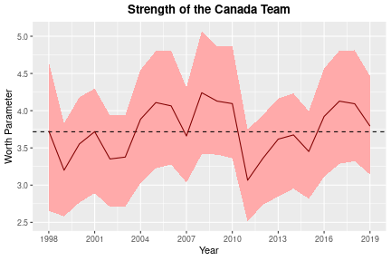

## Introduction

In this vignette, we present the empirical study of Holý and Zouhar (2022) which analyzes the results of the Ice Hockey World Championships. Our main object of interest is the annual ranking of 16 teams participating in the championships. For an in-depth overview of statistical toolkit for ranking data, see e.g. Alvo and Yu (2014). However, as Yu et al. (2019) point out, the time perspective is often overlooked in the ranking literature. This is where the GAS model comes into play.


```r
library(tidyverse)
library(gasmodel)
```

## Data Preparation

Our analyzed data are supplied in the `ice_hockey_championships` dataset. We restrict ourselves to years 1998--2019 just as Holý and Zouhar (2022). In 1998, the number of teams in the tournament increased from 12 to 16. In 2020, the championship was cancelled due to Covid-19 pandemic. We create two variables -- the final ranking of 16 participating teams in each year `y` and the dummy variable indicating which country (or countries) hosted the championship in each year `x`.


```r
data(ice_hockey_championships)
t <- 22
n <- ncol(ice_hockey_championships$host)
y <- ice_hockey_championships$rankings[1:t, ]
x <- setNames(lapply(1:n, function(i) { ice_hockey_championships$host[1:t, i] }), colnames(y))
```

We look at some basic statistics. In our sample, nine countries have participated each year:


```r
participate <- colSums(is.finite(y))
names(participate)[participate == t]
#> [1] "CAN" "CHE" "CZE" "FIN" "LVA" "RUS" "SVK" "SWE" "USA"
```

The following countries hosted the championships:


```r
host <- sapply(x, FUN = sum)
host[host > 0L]
#> AUT BLR CAN CHE CZE DEU FIN FRA LVA NOR RUS SVK SWE 
#>   1   1   1   2   2   3   3   1   1   1   3   2   3
```

The following countries won the gold metal:


```r
gold <- colSums(y == 1L)
gold[gold > 0L]
#> CAN CZE FIN RUS SVK SWE 
#>   5   5   2   4   1   5
```

## Model Estimation

The `gasmodel` package provides a single distribution on rankings -- the Plackett--Luce distribution:


```r
distr(filter_type = "ranking")
#>      distr_title param_title distr param    type   dim orthog default
#> 17 Plackett-Luce       Worth pluce worth ranking multi  FALSE    TRUE
```

It is a convenient and simple probability distribution on rankings utilizing a worth parameter for each item to be ranked. It originates from Luce’s choice axiom and is also related to the Thurstone’s theory of comparative judgment, see Luce (1977) and Yellott (1977). For more details, see Plackett (1975), Stern (1990), and Critchlow et al. (1991).

We consider three different models in total. First, we estimate the static model:


```r
est_static <- gas(y = y, x = x, distr = "pluce", p = 0, q = 0,
  coef_fix_special = c("zero_sum_intercept", "panel_structure"))

est_static
#> GAS Model: Plackett-Luce Distribution / Worth Parametrization / Unit Scaling 
#> 
#> Coefficients: 
#>                     Estimate Std. Error  Z-Test  Pr(>|Z|)    
#> log(worth1)_omega  -0.886065   0.279820 -3.1665 0.0015426 ** 
#> log(worth1)_beta1   0.170733   0.262163  0.6512 0.5148870    
#> log(worth2)_omega   0.108524   0.260858  0.4160 0.6773910    
#> log(worth2)_beta1   0.170733   0.262163  0.6512 0.5148870    
#> log(worth3)_omega   3.716810   0.296214 12.5477 < 2.2e-16 ***
#> log(worth3)_beta1   0.170733   0.262163  0.6512 0.5148870    
#> log(worth4)_omega   1.759760   0.258402  6.8102 9.749e-12 ***
#> log(worth4)_beta1   0.170733   0.262163  0.6512 0.5148870    
#> log(worth5)_omega   3.405212   0.292305 11.6495 < 2.2e-16 ***
#> log(worth5)_beta1   0.170733   0.262163  0.6512 0.5148870    
#> log(worth6)_omega   0.310967   0.267086  1.1643 0.2443037    
#> log(worth6)_beta1   0.170733   0.262163  0.6512 0.5148870    
#> log(worth7)_omega  -0.174836   0.267298 -0.6541 0.5130557    
#> log(worth7)_beta1   0.170733   0.262163  0.6512 0.5148870    
#> log(worth8)_omega   3.664354   0.296329 12.3658 < 2.2e-16 ***
#> log(worth8)_beta1   0.170733   0.262163  0.6512 0.5148870    
#> log(worth9)_omega  -0.508977   0.271489 -1.8748 0.0608254 .  
#> log(worth9)_beta1   0.170733   0.262163  0.6512 0.5148870    
#> log(worth10)_omega -3.885615   0.965475 -4.0246 5.708e-05 ***
#> log(worth10)_beta1  0.170733   0.262163  0.6512 0.5148870    
#> log(worth11)_omega -3.201107   0.688220 -4.6513 3.299e-06 ***
#> log(worth11)_beta1  0.170733   0.262163  0.6512 0.5148870    
#> log(worth12)_omega -1.098306   0.295764 -3.7134 0.0002045 ***
#> log(worth12)_beta1  0.170733   0.262163  0.6512 0.5148870    
#> log(worth13)_omega -1.939966   0.382723 -5.0689 4.002e-07 ***
#> log(worth13)_beta1  0.170733   0.262163  0.6512 0.5148870    
#> log(worth14)_omega -1.781260   0.361049 -4.9336 8.074e-07 ***
#> log(worth14)_beta1  0.170733   0.262163  0.6512 0.5148870    
#> log(worth15)_omega -3.907463   0.965400 -4.0475 5.177e-05 ***
#> log(worth15)_beta1  0.170733   0.262163  0.6512 0.5148870    
#> log(worth16)_omega  0.821959   0.247794  3.3171 0.0009096 ***
#> log(worth16)_beta1  0.170733   0.262163  0.6512 0.5148870    
#> log(worth17)_omega -0.074269   0.269070 -0.2760 0.7825318    
#> log(worth17)_beta1  0.170733   0.262163  0.6512 0.5148870    
#> log(worth18)_omega -3.897461   0.965457 -4.0369 5.416e-05 ***
#> log(worth18)_beta1  0.170733   0.262163  0.6512 0.5148870    
#> log(worth19)_omega  3.165045   0.300729 10.5246 < 2.2e-16 ***
#> log(worth19)_beta1  0.170733   0.262163  0.6512 0.5148870    
#> log(worth20)_omega  1.548835   0.263385  5.8805 4.090e-09 ***
#> log(worth20)_beta1  0.170733   0.262163  0.6512 0.5148870    
#> log(worth21)_omega -1.638001   0.342807 -4.7782 1.769e-06 ***
#> log(worth21)_beta1  0.170733   0.262163  0.6512 0.5148870    
#> log(worth22)_omega  3.837546   0.300147 12.7855 < 2.2e-16 ***
#> log(worth22)_beta1  0.170733   0.262163  0.6512 0.5148870    
#> log(worth23)_omega -1.523773   0.345577 -4.4094 1.037e-05 ***
#> log(worth23)_beta1  0.170733   0.262163  0.6512 0.5148870    
#> log(worth24)_omega  2.178086   0.277265  7.8556 3.979e-15 ***
#> log(worth24)_beta1  0.170733   0.262163  0.6512 0.5148870    
#> ---
#> Signif. codes:  0 '***' 0.001 '**' 0.01 '*' 0.05 '.' 0.1 ' ' 1
#> 
#> Log-Likelihood: -625.7998, AIC: 1299.6, BIC: 1325.785
```

Second, we estimate the standard mean-reverting GAS model of order one:


```r
est_gas <- gas(y = y, x = x, distr = "pluce",
  coef_fix_special = c("zero_sum_intercept", "panel_structure"),
  coef_start = as.vector(rbind(est_static$fit$par_unc / 2, 0, 0.5, 0.5)))

est_gas
#> GAS Model: Plackett-Luce Distribution / Worth Parametrization / Unit Scaling 
#> 
#> Coefficients: 
#>                      Estimate Std. Error  Z-Test  Pr(>|Z|)    
#> log(worth1)_omega   -0.411094   0.240601 -1.7086 0.0875232 .  
#> log(worth1)_beta1    0.227438   0.257598  0.8829 0.3772815    
#> log(worth1)_alpha1   0.391943   0.082695  4.7396 2.141e-06 ***
#> log(worth1)_phi1     0.506248   0.148399  3.4114 0.0006463 ***
#> log(worth2)_omega    0.125523   0.196261  0.6396 0.5224518    
#> log(worth2)_beta1    0.227438   0.257598  0.8829 0.3772815    
#> log(worth2)_alpha1   0.391943   0.082695  4.7396 2.141e-06 ***
#> log(worth2)_phi1     0.506248   0.148399  3.4114 0.0006463 ***
#> log(worth3)_omega    1.835425   0.612024  2.9989 0.0027092 ** 
#> log(worth3)_beta1    0.227438   0.257598  0.8829 0.3772815    
#> log(worth3)_alpha1   0.391943   0.082695  4.7396 2.141e-06 ***
#> log(worth3)_phi1     0.506248   0.148399  3.4114 0.0006463 ***
#> log(worth4)_omega    0.826797   0.307822  2.6860 0.0072322 ** 
#> log(worth4)_beta1    0.227438   0.257598  0.8829 0.3772815    
#> log(worth4)_alpha1   0.391943   0.082695  4.7396 2.141e-06 ***
#> log(worth4)_phi1     0.506248   0.148399  3.4114 0.0006463 ***
#> log(worth5)_omega    1.711820   0.555883  3.0795 0.0020738 ** 
#> log(worth5)_beta1    0.227438   0.257598  0.8829 0.3772815    
#> log(worth5)_alpha1   0.391943   0.082695  4.7396 2.141e-06 ***
#> log(worth5)_phi1     0.506248   0.148399  3.4114 0.0006463 ***
#> log(worth6)_omega    0.138403   0.207641  0.6665 0.5050601    
#> log(worth6)_beta1    0.227438   0.257598  0.8829 0.3772815    
#> log(worth6)_alpha1   0.391943   0.082695  4.7396 2.141e-06 ***
#> log(worth6)_phi1     0.506248   0.148399  3.4114 0.0006463 ***
#> log(worth7)_omega   -0.036155   0.188575 -0.1917 0.8479553    
#> log(worth7)_beta1    0.227438   0.257598  0.8829 0.3772815    
#> log(worth7)_alpha1   0.391943   0.082695  4.7396 2.141e-06 ***
#> log(worth7)_phi1     0.506248   0.148399  3.4114 0.0006463 ***
#> log(worth8)_omega    1.825416   0.590961  3.0889 0.0020090 ** 
#> log(worth8)_beta1    0.227438   0.257598  0.8829 0.3772815    
#> log(worth8)_alpha1   0.391943   0.082695  4.7396 2.141e-06 ***
#> log(worth8)_phi1     0.506248   0.148399  3.4114 0.0006463 ***
#> log(worth9)_omega   -0.199921   0.204617 -0.9771 0.3285437    
#> log(worth9)_beta1    0.227438   0.257598  0.8829 0.3772815    
#> log(worth9)_alpha1   0.391943   0.082695  4.7396 2.141e-06 ***
#> log(worth9)_phi1     0.506248   0.148399  3.4114 0.0006463 ***
#> log(worth10)_omega  -1.933670   0.767879 -2.5182 0.0117958 *  
#> log(worth10)_beta1   0.227438   0.257598  0.8829 0.3772815    
#> log(worth10)_alpha1  0.391943   0.082695  4.7396 2.141e-06 ***
#> log(worth10)_phi1    0.506248   0.148399  3.4114 0.0006463 ***
#> log(worth11)_omega  -1.620691   0.610275 -2.6557 0.0079150 ** 
#> log(worth11)_beta1   0.227438   0.257598  0.8829 0.3772815    
#> log(worth11)_alpha1  0.391943   0.082695  4.7396 2.141e-06 ***
#> log(worth11)_phi1    0.506248   0.148399  3.4114 0.0006463 ***
#> log(worth12)_omega  -0.504331   0.269737 -1.8697 0.0615238 .  
#> log(worth12)_beta1   0.227438   0.257598  0.8829 0.3772815    
#> log(worth12)_alpha1  0.391943   0.082695  4.7396 2.141e-06 ***
#> log(worth12)_phi1    0.506248   0.148399  3.4114 0.0006463 ***
#> log(worth13)_omega  -0.985013   0.383383 -2.5693 0.0101913 *  
#> log(worth13)_beta1   0.227438   0.257598  0.8829 0.3772815    
#> log(worth13)_alpha1  0.391943   0.082695  4.7396 2.141e-06 ***
#> log(worth13)_phi1    0.506248   0.148399  3.4114 0.0006463 ***
#> log(worth14)_omega  -0.904307   0.355985 -2.5403 0.0110759 *  
#> log(worth14)_beta1   0.227438   0.257598  0.8829 0.3772815    
#> log(worth14)_alpha1  0.391943   0.082695  4.7396 2.141e-06 ***
#> log(worth14)_phi1    0.506248   0.148399  3.4114 0.0006463 ***
#> log(worth15)_omega  -1.955842   0.773200 -2.5295 0.0114211 *  
#> log(worth15)_beta1   0.227438   0.257598  0.8829 0.3772815    
#> log(worth15)_alpha1  0.391943   0.082695  4.7396 2.141e-06 ***
#> log(worth15)_phi1    0.506248   0.148399  3.4114 0.0006463 ***
#> log(worth16)_omega   0.425713   0.226028  1.8835 0.0596388 .  
#> log(worth16)_beta1   0.227438   0.257598  0.8829 0.3772815    
#> log(worth16)_alpha1  0.391943   0.082695  4.7396 2.141e-06 ***
#> log(worth16)_phi1    0.506248   0.148399  3.4114 0.0006463 ***
#> log(worth17)_omega   0.016516   0.181370  0.0911 0.9274426    
#> log(worth17)_beta1   0.227438   0.257598  0.8829 0.3772815    
#> log(worth17)_alpha1  0.391943   0.082695  4.7396 2.141e-06 ***
#> log(worth17)_phi1    0.506248   0.148399  3.4114 0.0006463 ***
#> log(worth18)_omega  -1.950521   0.770869 -2.5303 0.0113968 *  
#> log(worth18)_beta1   0.227438   0.257598  0.8829 0.3772815    
#> log(worth18)_alpha1  0.391943   0.082695  4.7396 2.141e-06 ***
#> log(worth18)_phi1    0.506248   0.148399  3.4114 0.0006463 ***
#> log(worth19)_omega   1.603105   0.547669  2.9271 0.0034209 ** 
#> log(worth19)_beta1   0.227438   0.257598  0.8829 0.3772815    
#> log(worth19)_alpha1  0.391943   0.082695  4.7396 2.141e-06 ***
#> log(worth19)_phi1    0.506248   0.148399  3.4114 0.0006463 ***
#> log(worth20)_omega   0.815066   0.296970  2.7446 0.0060583 ** 
#> log(worth20)_beta1   0.227438   0.257598  0.8829 0.3772815    
#> log(worth20)_alpha1  0.391943   0.082695  4.7396 2.141e-06 ***
#> log(worth20)_phi1    0.506248   0.148399  3.4114 0.0006463 ***
#> log(worth21)_omega  -0.865332   0.338699 -2.5549 0.0106228 *  
#> log(worth21)_beta1   0.227438   0.257598  0.8829 0.3772815    
#> log(worth21)_alpha1  0.391943   0.082695  4.7396 2.141e-06 ***
#> log(worth21)_phi1    0.506248   0.148399  3.4114 0.0006463 ***
#> log(worth22)_omega   1.803007   0.603897  2.9856 0.0028300 ** 
#> log(worth22)_beta1   0.227438   0.257598  0.8829 0.3772815    
#> log(worth22)_alpha1  0.391943   0.082695  4.7396 2.141e-06 ***
#> log(worth22)_phi1    0.506248   0.148399  3.4114 0.0006463 ***
#> log(worth23)_omega  -0.662936   0.301776 -2.1968 0.0280358 *  
#> log(worth23)_beta1   0.227438   0.257598  0.8829 0.3772815    
#> log(worth23)_alpha1  0.391943   0.082695  4.7396 2.141e-06 ***
#> log(worth23)_phi1    0.506248   0.148399  3.4114 0.0006463 ***
#> log(worth24)_omega   0.903025   0.350262  2.5781 0.0099334 ** 
#> log(worth24)_beta1   0.227438   0.257598  0.8829 0.3772815    
#> log(worth24)_alpha1  0.391943   0.082695  4.7396 2.141e-06 ***
#> log(worth24)_phi1    0.506248   0.148399  3.4114 0.0006463 ***
#> ---
#> Signif. codes:  0 '***' 0.001 '**' 0.01 '*' 0.05 '.' 0.1 ' ' 1
#> 
#> Log-Likelihood: -611.1953, AIC: 1274.391, BIC: 1302.758
```

Third, we estimate the random walk model:


```r
est_walk <- gas(y = y, x = lapply(x, cumsum), distr = "pluce", spec = "reg_err",
  coef_fix_special = c("zero_sum_intercept", "panel_structure", "random_walk"),
  coef_start = as.vector(rbind(est_static$fit$par_unc, 0, 0.5, 1)))

est_walk
#> GAS Model: Plackett-Luce Distribution / Worth Parametrization / Unit Scaling 
#> 
#> Coefficients: 
#>                      Estimate Std. Error  Z-Test  Pr(>|Z|)    
#> log(worth1)_omega    0.143020   0.721154  0.1983 0.8427945    
#> log(worth1)_beta1    0.098733   0.188063  0.5250 0.5995825    
#> log(worth1)_alpha1   0.343001   0.057619  5.9529 2.635e-09 ***
#> log(worth1)_phi1     1.000000   0.000000     Inf < 2.2e-16 ***
#> log(worth2)_omega    0.474332   0.968582  0.4897 0.6243335    
#> log(worth2)_beta1    0.098733   0.188063  0.5250 0.5995825    
#> log(worth2)_alpha1   0.343001   0.057619  5.9529 2.635e-09 ***
#> log(worth2)_phi1     1.000000   0.000000     Inf < 2.2e-16 ***
#> log(worth3)_omega    2.862096   0.695910  4.1127 3.910e-05 ***
#> log(worth3)_beta1    0.098733   0.188063  0.5250 0.5995825    
#> log(worth3)_alpha1   0.343001   0.057619  5.9529 2.635e-09 ***
#> log(worth3)_phi1     1.000000   0.000000     Inf < 2.2e-16 ***
#> log(worth4)_omega    1.673849   0.808717  2.0698 0.0384750 *  
#> log(worth4)_beta1    0.098733   0.188063  0.5250 0.5995825    
#> log(worth4)_alpha1   0.343001   0.057619  5.9529 2.635e-09 ***
#> log(worth4)_phi1     1.000000   0.000000     Inf < 2.2e-16 ***
#> log(worth5)_omega    3.592891   0.773873  4.6427 3.438e-06 ***
#> log(worth5)_beta1    0.098733   0.188063  0.5250 0.5995825    
#> log(worth5)_alpha1   0.343001   0.057619  5.9529 2.635e-09 ***
#> log(worth5)_phi1     1.000000   0.000000     Inf < 2.2e-16 ***
#> log(worth6)_omega   -0.657911   0.709827 -0.9269 0.3539989    
#> log(worth6)_beta1    0.098733   0.188063  0.5250 0.5995825    
#> log(worth6)_alpha1   0.343001   0.057619  5.9529 2.635e-09 ***
#> log(worth6)_phi1     1.000000   0.000000     Inf < 2.2e-16 ***
#> log(worth7)_omega   -0.811607   0.648131 -1.2522 0.2104874    
#> log(worth7)_beta1    0.098733   0.188063  0.5250 0.5995825    
#> log(worth7)_alpha1   0.343001   0.057619  5.9529 2.635e-09 ***
#> log(worth7)_phi1     1.000000   0.000000     Inf < 2.2e-16 ***
#> log(worth8)_omega    3.608168   0.826422  4.3660 1.265e-05 ***
#> log(worth8)_beta1    0.098733   0.188063  0.5250 0.5995825    
#> log(worth8)_alpha1   0.343001   0.057619  5.9529 2.635e-09 ***
#> log(worth8)_phi1     1.000000   0.000000     Inf < 2.2e-16 ***
#> log(worth9)_omega   -0.469121   0.886355 -0.5293 0.5966181    
#> log(worth9)_beta1    0.098733   0.188063  0.5250 0.5995825    
#> log(worth9)_alpha1   0.343001   0.057619  5.9529 2.635e-09 ***
#> log(worth9)_phi1     1.000000   0.000000     Inf < 2.2e-16 ***
#> log(worth10)_omega  -3.856949   1.114702 -3.4601 0.0005400 ***
#> log(worth10)_beta1   0.098733   0.188063  0.5250 0.5995825    
#> log(worth10)_alpha1  0.343001   0.057619  5.9529 2.635e-09 ***
#> log(worth10)_phi1    1.000000   0.000000     Inf < 2.2e-16 ***
#> log(worth11)_omega  -3.198759   0.902690 -3.5436 0.0003947 ***
#> log(worth11)_beta1   0.098733   0.188063  0.5250 0.5995825    
#> log(worth11)_alpha1  0.343001   0.057619  5.9529 2.635e-09 ***
#> log(worth11)_phi1    1.000000   0.000000     Inf < 2.2e-16 ***
#> log(worth12)_omega   0.189150   0.885648  0.2136 0.8308803    
#> log(worth12)_beta1   0.098733   0.188063  0.5250 0.5995825    
#> log(worth12)_alpha1  0.343001   0.057619  5.9529 2.635e-09 ***
#> log(worth12)_phi1    1.000000   0.000000     Inf < 2.2e-16 ***
#> log(worth13)_omega  -0.458330   0.860890 -0.5324 0.5944556    
#> log(worth13)_beta1   0.098733   0.188063  0.5250 0.5995825    
#> log(worth13)_alpha1  0.343001   0.057619  5.9529 2.635e-09 ***
#> log(worth13)_phi1    1.000000   0.000000     Inf < 2.2e-16 ***
#> log(worth14)_omega  -1.624154   0.871612 -1.8634 0.0624073 .  
#> log(worth14)_beta1   0.098733   0.188063  0.5250 0.5995825    
#> log(worth14)_alpha1  0.343001   0.057619  5.9529 2.635e-09 ***
#> log(worth14)_phi1    1.000000   0.000000     Inf < 2.2e-16 ***
#> log(worth15)_omega  -3.872201   1.114874 -3.4732 0.0005143 ***
#> log(worth15)_beta1   0.098733   0.188063  0.5250 0.5995825    
#> log(worth15)_alpha1  0.343001   0.057619  5.9529 2.635e-09 ***
#> log(worth15)_phi1    1.000000   0.000000     Inf < 2.2e-16 ***
#> log(worth16)_omega   0.786687   0.773040  1.0177 0.3088425    
#> log(worth16)_beta1   0.098733   0.188063  0.5250 0.5995825    
#> log(worth16)_alpha1  0.343001   0.057619  5.9529 2.635e-09 ***
#> log(worth16)_phi1    1.000000   0.000000     Inf < 2.2e-16 ***
#> log(worth17)_omega  -0.656643   0.701983 -0.9354 0.3495762    
#> log(worth17)_beta1   0.098733   0.188063  0.5250 0.5995825    
#> log(worth17)_alpha1  0.343001   0.057619  5.9529 2.635e-09 ***
#> log(worth17)_phi1    1.000000   0.000000     Inf < 2.2e-16 ***
#> log(worth18)_omega  -3.873149   1.148695 -3.3718 0.0007468 ***
#> log(worth18)_beta1   0.098733   0.188063  0.5250 0.5995825    
#> log(worth18)_alpha1  0.343001   0.057619  5.9529 2.635e-09 ***
#> log(worth18)_phi1    1.000000   0.000000     Inf < 2.2e-16 ***
#> log(worth19)_omega   1.843343   0.797089  2.3126 0.0207451 *  
#> log(worth19)_beta1   0.098733   0.188063  0.5250 0.5995825    
#> log(worth19)_alpha1  0.343001   0.057619  5.9529 2.635e-09 ***
#> log(worth19)_phi1    1.000000   0.000000     Inf < 2.2e-16 ***
#> log(worth20)_omega   2.154757   0.738903  2.9162 0.0035437 ** 
#> log(worth20)_beta1   0.098733   0.188063  0.5250 0.5995825    
#> log(worth20)_alpha1  0.343001   0.057619  5.9529 2.635e-09 ***
#> log(worth20)_phi1    1.000000   0.000000     Inf < 2.2e-16 ***
#> log(worth21)_omega  -1.629159   0.775014 -2.1021 0.0355443 *  
#> log(worth21)_beta1   0.098733   0.188063  0.5250 0.5995825    
#> log(worth21)_alpha1  0.343001   0.057619  5.9529 2.635e-09 ***
#> log(worth21)_phi1    1.000000   0.000000     Inf < 2.2e-16 ***
#> log(worth22)_omega   3.204975   0.753831  4.2516 2.123e-05 ***
#> log(worth22)_beta1   0.098733   0.188063  0.5250 0.5995825    
#> log(worth22)_alpha1  0.343001   0.057619  5.9529 2.635e-09 ***
#> log(worth22)_phi1    1.000000   0.000000     Inf < 2.2e-16 ***
#> log(worth23)_omega  -0.395006   0.674087 -0.5860 0.5578847    
#> log(worth23)_beta1   0.098733   0.188063  0.5250 0.5995825    
#> log(worth23)_alpha1  0.343001   0.057619  5.9529 2.635e-09 ***
#> log(worth23)_phi1    1.000000   0.000000     Inf < 2.2e-16 ***
#> log(worth24)_omega   0.969720   0.672139  1.4427 0.1490947    
#> log(worth24)_beta1   0.098733   0.188063  0.5250 0.5995825    
#> log(worth24)_alpha1  0.343001   0.057619  5.9529 2.635e-09 ***
#> log(worth24)_phi1    1.000000   0.000000     Inf < 2.2e-16 ***
#> ---
#> Signif. codes:  0 '***' 0.001 '**' 0.01 '*' 0.05 '.' 0.1 ' ' 1
#> 
#> Log-Likelihood: -625.4253, AIC: 1300.851, BIC: 1328.127
```

The random walk model should be approached with caution as it is not stationary.

We compare the models using the Akaike information criterion (AIC):


```r
AIC(est_static, est_gas, est_walk)
#>            df      AIC
#> est_static 24 1299.600
#> est_gas    26 1274.391
#> est_walk   25 1300.851
```
In terms of AIC, the mean-reverting model outperformed the remaining two by a wide margin. In all three models, coefficient $\alpha_1$ representing the home advantage is positive but not significant.

## Who Is the Best?

Our models allows us to construct the ‘ultimate’ (or long-run) ranking. Both the static and mean-reverting models confirm the dominance of the Big Six. Indeed, the rankings in both models agree in all but the first three places; the long-term strength estimates for these three teams are very close to one another, though, making the eventual ranking less clear cut.


```r
tibble(team = colnames(y)) %>%
  mutate(gas_strength = est_gas$fit$par_unc) %>%
  mutate(gas_rank = rank(-gas_strength)) %>%
  mutate(static_strength = est_static$fit$par_unc) %>%
  mutate(static_rank = rank(-static_strength)) %>%
  arrange(gas_rank)
#> # A tibble: 24 × 5
#>    team  gas_strength gas_rank static_strength static_rank
#>    <chr>        <dbl>    <dbl>           <dbl>       <dbl>
#>  1 CAN         3.72          1          3.72             2
#>  2 FIN         3.70          2          3.66             3
#>  3 SWE         3.65          3          3.84             1
#>  4 CZE         3.47          4          3.41             4
#>  5 RUS         3.25          5          3.17             5
#>  6 USA         1.83          6          2.18             6
#>  7 CHE         1.67          7          1.76             7
#>  8 SVK         1.65          8          1.55             8
#>  9 LVA         0.862         9          0.822            9
#> 10 DEU         0.280        10          0.311           10
#> 11 BLR         0.254        11          0.109           11
#> 12 NOR         0.0335       12         -0.0743          12
#> 13 DNK        -0.0732       13         -0.175           13
#> 14 FRA        -0.405        14         -0.509           14
#> 15 AUT        -0.833        15         -0.886           15
#> 16 ITA        -1.02         16         -1.10            16
#> 17 UKR        -1.34         17         -1.52            17
#> 18 SVN        -1.75         18         -1.64            18
#> 19 KAZ        -1.83         19         -1.78            19
#> 20 JPN        -1.99         20         -1.94            20
#> 21 HUN        -3.28         21         -3.20            21
#> 22 GBR        -3.92         22         -3.89            22
#> 23 POL        -3.95         23         -3.90            23
#> 24 KOR        -3.96         24         -3.91            24
```

We can also take a look at the progression of the worth parameters of the individual teams over the years:


```r
ggplot(mapping = aes(x = 1998:2019, y = est_gas$fit$par_tv[, 3])) +
  labs(title = "Strength of the Canada Team", x = "Year", y = "Worth Parameter") +
  geom_hline(yintercept = est_gas$fit$par_unc[3], linetype = "dashed") +
  geom_line(color = "#D52B1E") +
  scale_x_continuous(breaks = seq(from = 1998, to = 2019, by = 3)) +
  theme_bw()
```



## Forecasting

Finally, we perform one-year-ahead forecasts:


```r
fcst_gas <- gas_forecast(est_gas, x_ahead = 0)

tibble(team = colnames(y)) %>%
  mutate(forecasted_strength = fcst_gas$forecast$par_tv_ahead_mean[1, ]) %>%
  mutate(forecasted_gold = exp(forecasted_strength) / sum(exp(forecasted_strength))) %>%
  mutate(forecasted_rank = rank(-forecasted_strength)) %>%
  mutate(real_rank = ice_hockey_championships$rankings[24, ]) %>%
  arrange(real_rank)
#> # A tibble: 24 × 5
#>    team  forecasted_strength forecasted_gold forecasted_rank real_rank
#>    <chr>               <dbl>           <dbl>           <dbl>     <dbl>
#>  1 CAN                 3.97        0.234                   2         1
#>  2 FIN                 3.97        0.235                   1         2
#>  3 USA                 2.09        0.0356                  6         3
#>  4 DEU                 0.742       0.00929                10         4
#>  5 RUS                 3.43        0.137                   3         5
#>  6 CHE                 1.82        0.0272                  7         6
#>  7 CZE                 3.41        0.134                   4         7
#>  8 SVK                 1.58        0.0214                  8         8
#>  9 SWE                 3.40        0.133                   5         9
#> 10 KAZ                -2.05        0.000569               19        10
#> 11 LVA                 0.978       0.0117                  9        11
#> 12 DNK                 0.229       0.00556                11        12
#> 13 NOR                 0.125       0.00501                12        13
#> 14 GBR                -3.55        0.000127               22        14
#> 15 BLR                -0.704       0.00219                14        15
#> 16 ITA                -0.957       0.00170                16        16
#> 17 AUT                -0.832       0.00192                15       Inf
#> 18 FRA                -0.490       0.00271                13       Inf
#> 19 HUN                -3.31        0.000162               21       Inf
#> 20 JPN                -2.21        0.000486               20       Inf
#> 21 KOR                -3.81        0.0000982              23       Inf
#> 22 POL                -3.99        0.0000821              24       Inf
#> 23 SVN                -1.95        0.000631               18       Inf
#> 24 UKR                -1.69        0.000813               17       Inf
```

## References

Alvo, M. and Yu, P. L. H. (2014). *Statistical Methods for Ranking Data*. Springer. doi: [10.1007/978-1-4939-1471-5](https://doi.org/10.1007/978-1-4939-1471-5).

Critchlow, D. E., Fligner, M. A., and Verducci, J. S. (1991). Probability Models on Rankings. *Journal of Mathematical Psychology*, **35**(3), 294–318. doi: [10.1016/0022-2496(91)90050-4](https://doi.org/10.1016/0022-2496(91)90050-4).

Holý, V. and Zouhar, J. (2021). Modelling Time-Varying Rankings with Autoregressive and Score-Driven Dynamics. Journal of the Royal Statistical Society: Series C (Applied Statistics). doi: [10.1111/rssc.12584](https://doi.org/10.1111/rssc.12584).

Luce, R. D. (1977). The Choice Axiom after Twenty Years. *Journal of Mathematical Psychology*, **15**(3), 215–233. doi: [10.1016/0022-2496(77)90032-3](https://doi.org/10.1016/0022-2496(77)90032-3).

Plackett, R. L. (1975). The Analysis of Permutations. *Journal of the Royal Statistical Society: Series C (Applied Statistics)*, **24**(2), 193–202. doi: [10.2307/2346567](https://doi.org/10.2307/2346567).

Stern, H. (1990). Models for Distributions on Permutations. *Journal of the American Statistical Association*, **85**(410), 558–564. doi: [10.1080/01621459.1990.10476235](https://doi.org/10.1080/01621459.1990.10476235).

Yellott, J. I. (1977). The Relationship Between Luce’s Choice Axiom, Thurstone’s Theory of Comparative Judgment, and the Double Exponential Distribution. *Journal of Mathematical Psychology*, **15**(2), 109–144. doi: [10.1016/0022-2496(77)90026-8](https://doi.org/10.1016/0022-2496(77)90026-8).

Yu, P. L. H., Gu, J., and Xu, H. (2019). Analysis of Ranking Data. *Wiley Interdisciplinary Reviews: Computational Statistics*, **11**(6), e1483, 1–26. doi: [10.1002/wics.1483](https://doi.org/10.1002/wics.1483).


